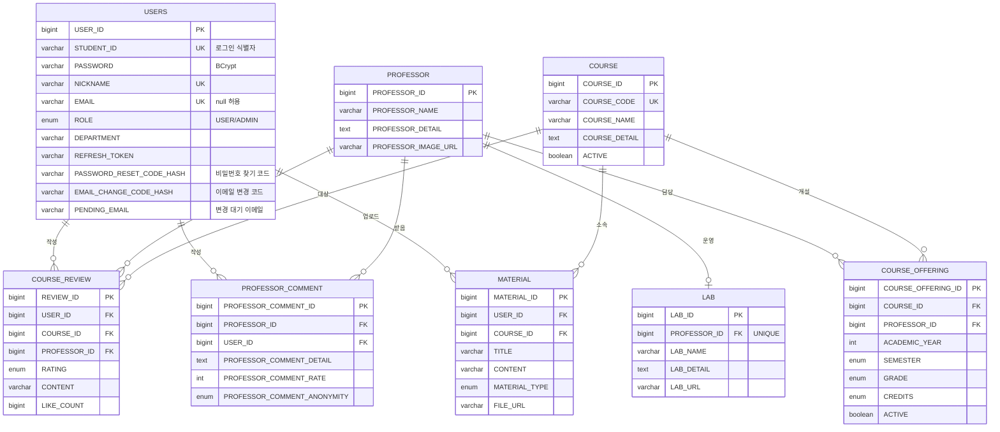

# ERD

**코드(엔티티) 기준으로 최신화한 문서** — 2026-09-19, `feat/password-reset-email` 브랜치 기준.
컬럼 타입·null 허용·제약은 엔티티 코드가 기준이다 (`@Column`, `@JoinColumn`, `@UniqueConstraint`).
엔티티를 바꾸는 PR에서는 이 문서도 같이 갱신한다.

## 공통 규칙

- PK는 전부 `BIGINT AUTO_INCREMENT` (`GenerationType.IDENTITY`)
- 테이블/컬럼 이름은 코드에 대문자(`USERS`, `COURSE_ID`)로 적혀 있지만, Spring Boot 기본 네이밍 전략 때문에
  **MySQL에는 소문자**(`users`, `course_id`)로 생성된다. `USERS`는 `USER`가 SQL 예약어일 수 있어서 붙인 이름
- 열거형(`enum`)은 `@Enumerated(EnumType.STRING)` — MySQL에는 `ENUM(...)` 타입으로 생성됨 (값 목록은 아래 "열거형" 참고)
- `BaseEntity`를 상속한 테이블(`USERS`, `COURSE_REVIEW`, `MATERIAL`)은 `CREATED_AT`/`UPDATED_AT`이 자동으로 채워짐
- **모든 FK에 삭제 정책(`ON DELETE`)을 따로 지정하지 않았다** → DB 기본값(`NO ACTION`)이라, 자식 행이 있으면 부모 행 삭제가 실패한다.
  그래서 `COURSE`/`COURSE_OFFERING`은 삭제 대신 `ACTIVE=false`로 내리는 방식을 쓴다

## 테이블 목록

| 테이블 | 설명 | 담당 도메인 패키지 | 상태 |
|---|---|---|---|
| `USERS` | 사용자 (학번 기반 인증, 이메일 인증코드 포함) | user | 구현 |
| `PROFESSOR` | 교수 정보 | professor | 구현 |
| `LAB` | 연구실 정보 (교수와 1:1) | lab | 구현 |
| `PROFESSOR_COMMENT` | 교수 후기 (CLAUDE.md의 `professor_review`) | professorComment | 구현 |
| `COURSE` | 전공 과목 자체 정보 (학기가 바뀌어도 불변) | course | 구현 |
| `COURSE_OFFERING` | 학년도/학기별 개설 정보 (담당 교수·시간표·학점 등) | course | 구현 |
| `COURSE_REVIEW` | 수업 후기 (학점별 필터 대상) | courseReview | 구현 |
| `MATERIAL` | 수업 자료 | material | 구현 |
| `POST` | 게시글 | community | 미구현 (엔티티 없음) |
| `COMMENT` | 댓글 | community | 미구현 (엔티티 없음) |
| `CAREER_STORY` | 진로 수기 | career | 미구현 (엔티티 없음) |
| `FAVORITE` | 즐겨찾기 | mypage | 미구현 (엔티티 없음) |
| `NOTIFICATION` | 알림 | mypage | 미구현 (엔티티 없음) |

> CLAUDE.md의 "데이터 모델 (10개 테이블)"과 달라진 점: `professor_review`는 `PROFESSOR_COMMENT`로 구현됐고,
> 목록에 없던 `COURSE_OFFERING`, `LAB`, `MATERIAL`이 추가됐다.

## 다이어그램

구현된 8개 테이블만 그렸다. 컬럼은 PK/FK/UK와 핵심 컬럼만 표시하고, 전체 컬럼은 아래 "테이블 상세"를 본다.



## 관계와 삭제 정책

| 자식 (FK 보유) | FK 컬럼 | 부모 | 관계 | 삭제 정책 |
|---|---|---|---|---|
| `LAB` | `PROFESSOR_ID` (UNIQUE) | `PROFESSOR` | 1 : 0..1 | 명시 없음 (NO ACTION) |
| `PROFESSOR_COMMENT` | `PROFESSOR_ID` | `PROFESSOR` | 1 : N | 명시 없음 (NO ACTION) |
| `PROFESSOR_COMMENT` | `USER_ID` | `USERS` | 1 : N | 명시 없음 (NO ACTION) |
| `COURSE_OFFERING` | `COURSE_ID` | `COURSE` | 1 : N | 명시 없음 (NO ACTION) |
| `COURSE_OFFERING` | `PROFESSOR_ID` | `PROFESSOR` | 1 : N | 명시 없음 (NO ACTION) |
| `COURSE_REVIEW` | `USER_ID` | `USERS` | 1 : N | 명시 없음 (NO ACTION) |
| `COURSE_REVIEW` | `COURSE_ID` | `COURSE` | 1 : N | 명시 없음 (NO ACTION) |
| `COURSE_REVIEW` | `PROFESSOR_ID` | `PROFESSOR` | 1 : N | 명시 없음 (NO ACTION) |
| `MATERIAL` | `USER_ID` | `USERS` | 1 : N | 명시 없음 (NO ACTION) |
| `MATERIAL` | `COURSE_ID` | `COURSE` | 1 : N | 명시 없음 (NO ACTION) |

- 연관관계는 전부 `@ManyToOne`/`@OneToOne`, `fetch = LAZY`. `PROFESSOR`의 `lab`/`professorComments`/`courseOfferings`는 `mappedBy`(FK 없는 쪽)
- `COURSE_REVIEW`는 `COURSE_OFFERING`이 아니라 **`COURSE` + `PROFESSOR`를 직접 참조**한다. 학기마다 `COURSE_OFFERING` 행이 갱신돼도
  후기가 `courseId + professorId`로 계속 살아있게 하기 위함
- **삭제 정책은 아직 미정** — 후기가 달린 교수/과목을 삭제하면 FK 오류가 난다 (교수 삭제 시 교수 후기를 먼저 지울지 등 팀 논의 필요)

## 제약 조건 (UNIQUE)

| 테이블 | 제약 이름 | 컬럼 | 의미 |
|---|---|---|---|
| `USERS` | (자동) | `STUDENT_ID` | 학번 중복 가입 방지 |
| `USERS` | (자동) | `NICKNAME` | 닉네임 중복 방지 |
| `USERS` | (자동) | `EMAIL` | 이메일 중복 방지 (null은 여러 개 허용) |
| `COURSE` | (자동) | `COURSE_CODE` | 학수번호 |
| `COURSE_OFFERING` | `UK_COURSE_OFFERING` | `COURSE_ID`, `PROFESSOR_ID`, `ACADEMIC_YEAR`, `SEMESTER` | 같은 조합이면 새로 넣지 않고 갱신 (분반은 학기마다 재배정돼 키로 못 씀) |
| `COURSE_REVIEW` | `UK_USER_COURSE_PROFESSOR_REVIEW` | `USER_ID`, `COURSE_ID`, `PROFESSOR_ID` | 사용자당 (과목, 교수) 조합별 후기 1개 |
| `MATERIAL` | `UK_USER_COURSE_MATERIAL` | `USER_ID`, `COURSE_ID` | 사용자당 과목별 자료 1개 |
| `LAB` | (자동) | `PROFESSOR_ID` | 교수당 연구실 1개 (1:1) |

## 테이블 상세

`PK`=기본키, `FK`=외래키, `UK`=unique, `NN`=NOT NULL

### USERS (user)

| 컬럼 | 타입 | 제약 | 설명 |
|---|---|---|---|
| `USER_ID` | BIGINT | PK, AI | |
| `STUDENT_ID` | VARCHAR(20) | NN, UK | 로그인 식별자. **응답 DTO 노출 금지** |
| `PASSWORD` | VARCHAR(255) | NN | BCrypt 해시 |
| `NICKNAME` | VARCHAR(10) | NN, UK | 공개 응답에는 학번 대신 닉네임만 노출 |
| `ROLE` | ENUM | NN | `USER` / `ADMIN` |
| `DEPARTMENT` | VARCHAR(100) | | 회원가입 요청에 없어서 현재는 항상 null |
| `EMAIL` | VARCHAR(100) | UK | 비밀번호 찾기용 개인 이메일. **null 허용** (기존 행이 있는 DB에서 `ddl-auto: update`가 실패하지 않게), 회원가입 요청에서만 필수. 소문자/trim으로 정규화. 응답 DTO 노출 금지 |
| `REFRESH_TOKEN` | VARCHAR(500) | | 현재 평문 저장 (해시 전환 검토 중). 응답 DTO 노출 금지 |
| `REFRESH_TOKEN_EXPIRES_AT` | DATETIME | | |
| `PASSWORD_RESET_CODE_HASH` | VARCHAR(100) | | 비밀번호 찾기 인증코드의 BCrypt 해시 (원문 저장 안 함) |
| `PASSWORD_RESET_CODE_ISSUED_AT` | DATETIME | | 발급 시각 (재발송 쿨다운 60초 계산) |
| `PASSWORD_RESET_CODE_EXPIRES_AT` | DATETIME | | 만료 시각 (발급 후 5분) |
| `PASSWORD_RESET_CODE_FAILED_ATTEMPTS` | INT | | 틀린 횟수 (5회면 코드 폐기) |
| `EMAIL_CHANGE_CODE_HASH` | VARCHAR(100) | | 이메일 변경 인증코드 해시 — **비밀번호 찾기 코드와 컬럼을 분리** (코드 재사용 우회 방지) |
| `EMAIL_CHANGE_CODE_ISSUED_AT` | DATETIME | | |
| `EMAIL_CHANGE_CODE_EXPIRES_AT` | DATETIME | | |
| `EMAIL_CHANGE_CODE_FAILED_ATTEMPTS` | INT | | |
| `PENDING_EMAIL` | VARCHAR(100) | | 인증코드를 발송한 "새 이메일". 코드 검증 후 변경 요청의 이메일과 같아야 확정됨 |
| `CREATED_AT` | DATETIME(6) | NN | 자동 |
| `UPDATED_AT` | DATETIME(6) | NN | 자동 |

인증코드 4개 컬럼 묶음은 `VerificationCode`(`@Embeddable`)이며, 값이 없으면 4개 컬럼이 모두 null이다.

### PROFESSOR (professor)

| 컬럼 | 타입 | 제약 | 설명 |
|---|---|---|---|
| `PROFESSOR_ID` | BIGINT | PK, AI | |
| `PROFESSOR_NAME` | VARCHAR(20) | NN | |
| `PROFESSOR_DETAIL` | TEXT | NN | |
| `PROFESSOR_IMAGE_URL` | VARCHAR(255) | | 사진 데이터가 아직 없어 null 허용 (없으면 프론트에서 기본 이미지) |

### LAB (lab)

| 컬럼 | 타입 | 제약 | 설명 |
|---|---|---|---|
| `LAB_ID` | BIGINT | PK, AI | |
| `PROFESSOR_ID` | BIGINT | FK, NN, UK | 교수와 1:1 |
| `LAB_NAME` | VARCHAR(100) | | |
| `LAB_DETAIL` | TEXT | | |
| `LAB_URL` | VARCHAR(255) | | |

### PROFESSOR_COMMENT (professorComment)

| 컬럼 | 타입 | 제약 | 설명 |
|---|---|---|---|
| `PROFESSOR_COMMENT_ID` | BIGINT | PK, AI | |
| `PROFESSOR_ID` | BIGINT | FK, NN | |
| `USER_ID` | BIGINT | FK, NN | 작성자 |
| `PROFESSOR_COMMENT_DETAIL` | TEXT | NN | |
| `PROFESSOR_COMMENT_RATE` | INT | NN | 평점 |
| `PROFESSOR_COMMENT_DATE` | DATETIME | NN | 작성 시각 (자동) |
| `PROFESSOR_COMMENT_ANONYMITY` | ENUM | NN | `TRUE` / `FALSE` |

DB UNIQUE 제약은 없다. 한 사용자가 같은 교수에게 후기를 여러 개 남길 수 있는지는 DB가 아니라 서비스 로직에서 정한다.

### COURSE (course)

학기가 바뀌어도 안 변하는 "과목 자체" 정보만 가진다.

| 컬럼 | 타입 | 제약 | 설명 |
|---|---|---|---|
| `COURSE_ID` | BIGINT | PK, AI | |
| `COURSE_NAME` | VARCHAR(100) | NN | |
| `COURSE_CODE` | VARCHAR(20) | NN, UK | 학수번호 |
| `COURSE_DETAIL` | TEXT | NN | |
| `ACTIVE` | BOOLEAN | NN | 이번 학기 시간표에 없으면 `false`로 내리고 DELETE는 하지 않음 (후기가 참조) |

### COURSE_OFFERING (course)

특정 학년도/학기에 특정 교수가 개설한 과목 1건. 분반은 학기마다 재배정돼서 저장하지 않는다.

| 컬럼 | 타입 | 제약 | 설명 |
|---|---|---|---|
| `COURSE_OFFERING_ID` | BIGINT | PK, AI | |
| `COURSE_ID` | BIGINT | FK, NN | |
| `PROFESSOR_ID` | BIGINT | FK, NN | |
| `ACADEMIC_YEAR` | INT | NN | 학년도 |
| `SEMESTER` | ENUM | NN | |
| `GRADE` | ENUM | NN | 대상 학년 |
| `CREDITS` | ENUM | NN | 학점 |
| `COURSE_TIME` | VARCHAR(255) | NN | 강의 시간 |
| `COURSE_TYPE` | ENUM | NN | 전공 구분 |
| `EVALUATION_TYPE` | ENUM | NN | 절대/상대평가 |
| `IS_ONLINE` | ENUM | NN | 강의 방식 |
| `ACTIVE` | BOOLEAN | NN | 이번 학기 시간표에 다시 안 나오면 `false` (DELETE 안 함) |

### COURSE_REVIEW (courseReview)

| 컬럼 | 타입 | 제약 | 설명 |
|---|---|---|---|
| `REVIEW_ID` | BIGINT | PK, AI | |
| `USER_ID` | BIGINT | FK, NN | 작성자 |
| `COURSE_ID` | BIGINT | FK, NN | |
| `PROFESSOR_ID` | BIGINT | FK, NN | 같은 과목도 교수별로 후기를 나눔 |
| `RATING` | ENUM | NN | 별점 |
| `CONTENT` | VARCHAR(500) | NN | 20~500자 (`@Size`) |
| `TEXT_BOOK` | ENUM | NN | 교재 필요 여부 |
| `ASSIGNMENT_DIFFICULTY` | ENUM | NN | 과제 난이도 |
| `ASSIGNMENT_AMOUNT` | ENUM | NN | 과제 양 |
| `GROUP_ACTIVITY` | ENUM | NN | 조모임 정도 |
| `ATTENDANCE` | ENUM | NN | 출결 |
| `EXAM_COUNT` | ENUM | NN | 시험 횟수 |
| `QUIZ_DIFFICULTY` | ENUM | NN | 퀴즈 난이도 |
| `EXAM_DIFFICULTY` | ENUM | NN | 시험 난이도 |
| `QUIZ_COUNT` | ENUM | NN | 쪽지시험 횟수 |
| `GRADING_TYPE` | ENUM | NN | 학점 후한 정도 |
| `LIKE_COUNT` | BIGINT | NN | 기본값 0 |
| `CREATED_AT` | DATETIME(6) | NN | 자동 |
| `UPDATED_AT` | DATETIME(6) | NN | 자동 |

### MATERIAL (material)

| 컬럼 | 타입 | 제약 | 설명 |
|---|---|---|---|
| `MATERIAL_ID` | BIGINT | PK, AI | |
| `COURSE_ID` | BIGINT | FK, NN | |
| `USER_ID` | BIGINT | FK, NN | 업로더 |
| `TITLE` | VARCHAR(50) | NN | 10~50자 (`@Size`) |
| `CONTENT` | VARCHAR(500) | NN | 20~500자 (`@Size`) |
| `MATERIAL_TYPE` | ENUM | NN | |
| `FILE_URL` | VARCHAR(500) | | 파일 업로드는 선택이라 null 허용 |
| `ORIGINAL_FILE_NAME` | VARCHAR(100) | | 〃 |
| `FILE_SIZE` | BIGINT | | 〃 |
| `CREATED_AT` | DATETIME(6) | NN | 자동 |
| `UPDATED_AT` | DATETIME(6) | NN | 자동 |

## 열거형

| 이름 | 사용처 | 값 |
|---|---|---|
| `UserRole` | `USERS.ROLE` | `USER`, `ADMIN` |
| `ProfessorCommentAnonymity` | `PROFESSOR_COMMENT.PROFESSOR_COMMENT_ANONYMITY` | `TRUE`, `FALSE` |
| `Semester` | `COURSE_OFFERING.SEMESTER` | `FIRST`, `SECOND` |
| `Grade` | `COURSE_OFFERING.GRADE` | `FIRST`, `SECOND`, `THIRD`, `FOURTH` |
| `Credits` | `COURSE_OFFERING.CREDITS` | `FIRST`, `SECOND`, `THIRD`, `FOURTH` |
| `CourseType` | `COURSE_OFFERING.COURSE_TYPE` | `MAJOR_CORE`, `MAJOR_FOUNDATION`, `MAJOR_ADVANCED` |
| `EvaluationType` | `COURSE_OFFERING.EVALUATION_TYPE` | `ABSOLUTE`, `RELATIVE` |
| `IsOnline` | `COURSE_OFFERING.IS_ONLINE` | `BLENDED_LEARNING`, `ONLINE`, `OFFLINE` |
| `Rating` | `COURSE_REVIEW.RATING` | `ONE`, `TWO`, `THREE`, `FOUR`, `FIVE` |
| `TextBook` | `COURSE_REVIEW.TEXT_BOOK` | `REQUIRED`, `OPTIONAL`, `NOT_REQUIRED` |
| `Difficulty` | `COURSE_REVIEW.ASSIGNMENT_DIFFICULTY`, `QUIZ_DIFFICULTY`, `EXAM_DIFFICULTY` | `VERY_EASY`, `EASY`, `NORMAL`, `HARD`, `VERY_HARD` |
| `Amount` | `COURSE_REVIEW.ASSIGNMENT_AMOUNT` | `VERY_LOW`, `LOW`, `NORMAL`, `HIGH`, `VERY_HIGH` |
| `GroupActivity` | `COURSE_REVIEW.GROUP_ACTIVITY` | `NONE`, `VERY_LOW`, `OCCASIONAL`, `FREQUENT`, `VERY_FREQUENT` |
| `Attendance` | `COURSE_REVIEW.ATTENDANCE` | `STRICT`, `RANDOM`, `NONE` |
| `Count` | `COURSE_REVIEW.EXAM_COUNT`, `QUIZ_COUNT` | `ZERO` ~ `TEN` (`ZERO`, `ONE`, `TWO`, `THREE`, `FOUR`, `FIVE`, `SIX`, `SEVEN`, `EIGHT`, `NINE`, `TEN`) |
| `GradingType` | `COURSE_REVIEW.GRADING_TYPE` | `VERY_GENEROUS`, `GENEROUS`, `NORMAL`, `STRICT`, `VERY_STRICT` |
| `MaterialType` | `MATERIAL.MATERIAL_TYPE` | `LECTURE_NOTE`, `ASSIGNMENT`, `SUMMARY`, `PAST_EXAM`, `REFERENCE`, `OTHER`, `TEXTBOOK_PDF` |

(`ReviewSort`는 정렬 옵션용 enum이라 DB 컬럼이 아니다.)

## 주의: 로컬 DB가 코드와 어긋날 수 있다

`spring.jpa.hibernate.ddl-auto: update`는 **없는 테이블/컬럼은 추가하지만, 이미 있는 컬럼의 타입·null 여부는 바꾸지 않는다.**
그래서 예전 스키마로 만든 로컬 DB가 남아 있으면 이 문서(코드)와 다를 수 있다. 작성 시점에 확인한 실제 사례:

- `professor_comment`에 옛 오타 컬럼 `professor_comment_annonymity`가 남아 있고, 다른 컬럼들이 `NULL` 허용/`varchar(255)`로 남아 있음 (코드는 `NOT NULL`, `TEXT`)
- `professor.professor_detail`, `lab.lab_detail`이 `varchar(255)`로 남아 있음 (코드는 `TEXT`)
- `lab.professor_id`가 `NULL` 허용으로 남아 있음 (코드는 `NOT NULL`)

스키마가 이상하면 데이터가 필요 없을 때 아래로 볼륨째 지우고 다시 만든다 (`data.sql`이 기동 시 다시 들어감).

```bash
docker compose down -v && docker compose up -d
```

## 작성 규칙
- 엔티티(테이블·컬럼·FK·제약)를 추가/변경하는 PR은 이 문서도 같이 갱신한다. 기준은 코드이며, 로컬 DB가 아니다.
- 아직 엔티티가 없는 테이블은 "미구현"으로 두고, 컬럼이 확정돼 엔티티를 만들 때 다이어그램과 상세를 채운다.
- 연관관계(FK)는 방향과 삭제 정책(CASCADE 등)까지 명시한다. 현재는 전부 미지정(NO ACTION)이며, 정책이 정해지면 "관계와 삭제 정책" 표를 먼저 고친다.
